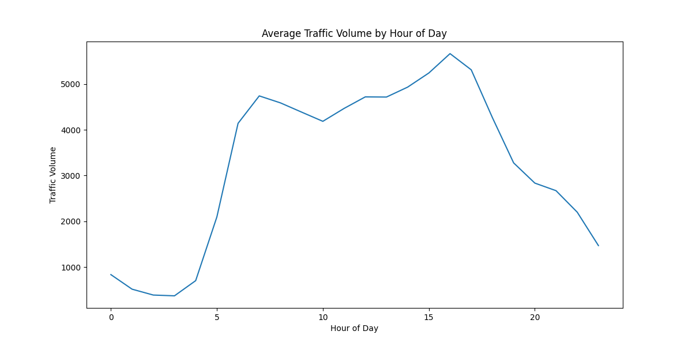
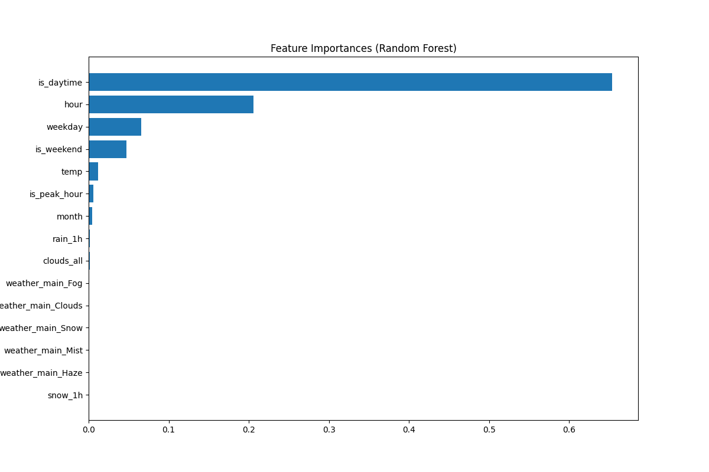
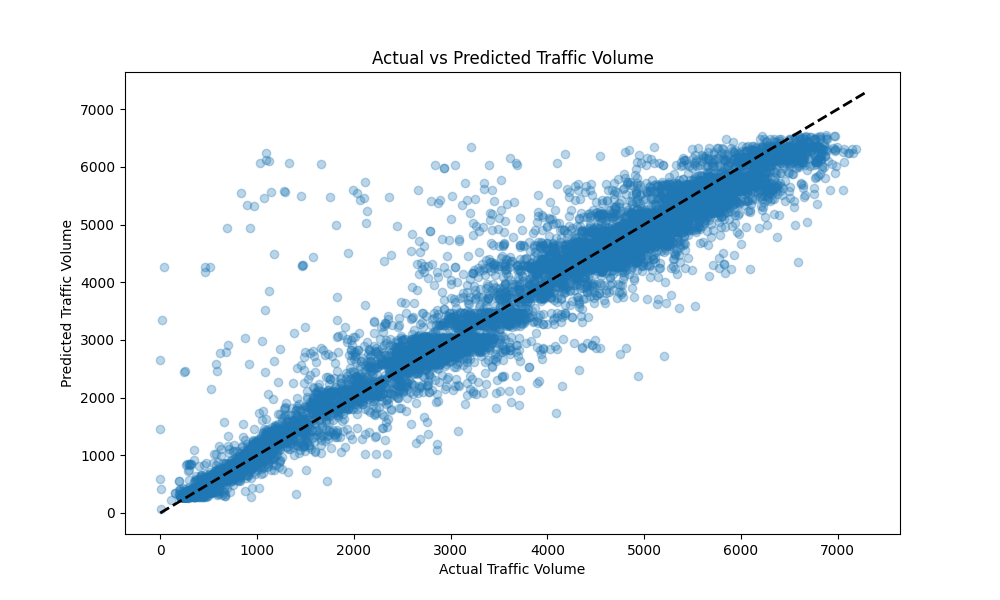

# 🚦 RUSH: Rapid Urban Smart Highway - Prediction


🌐 **Live App**: [vanchili.pythonanywhere.com](https://vanchili.pythonanywhere.com)  
📁 **GitHub Repo**: [github.com/vanshikachilkoti/RUSH](https://github.com/vanshikachilkoti/RUSH)

---

## 📌 Project Overview

**RUSH (Rapid Urban Smart Highway - Prediction)** is a full-stack machine learning web app designed to predict real-time traffic volume patterns based on weather and time data.

🚗 **Key Objective**: Reduce urban congestion and help users make smarter travel decisions using ML-powered forecasts.

---

## ✨ Key Features

- 🧠 **ML Models**: Uses a Stacked Regressor combining Random Forest and Gradient Boosting.
- 🌦️ **Weather-Aware**: Inputs include temperature, rain, snow, and cloud cover.
- 🕒 **Time-Aware**: Hour, day, peak time, weekend, and more are factored in.
- 📊 **Visual Analysis**: Heatmaps, time-series, residuals, and feature importance graphs.
- 🔮 **Smart Prediction Page**: Get predicted traffic volume and actionable recommendations.
- 📉 **Model Metrics**: MAE, RMSE, and R² scores shown to users.
- 💻 **Interactive Interface**: Built using Flask and deployed on PythonAnywhere.

---

## 🖼️ Screenshots

| Home Page | Analysis Page | Predict Page |
|-----------|---------------|--------------|
|  |  |  |

---

## 🧪 ML & Analytics Flow

1. **Data Preprocessing**
   - Feature extraction from datetime
   - Handling missing values
   - One-hot encoding for categorical variables

2. **Model Training**
   - Scaled input using `StandardScaler`
   - `RandomForestRegressor` and `GradientBoostingRegressor`
   - Combined via `StackingRegressor` with RidgeCV

3. **Evaluation Metrics**
   - MAE, RMSE, R² Score
   - Residual analysis and predictions visualization

4. **Saved Assets**
   - Trained model (`joblib`)
   - Scaler, metrics JSON, feature columns

---

## 🧰 Tech Stack

| Layer     | Tools Used                                 |
|-----------|---------------------------------------------|
| Frontend  | HTML, CSS, Bootstrap, Jinja2                |
| Backend   | Python, Flask                               |
| ML        | Scikit-learn, Pandas, NumPy                 |
| Visualization | Matplotlib, Seaborn                    |
| Deployment| PythonAnywhere                             |

---

## ⚙️ How to Run Locally

```bash
# Clone the repository
git clone https://github.com/vanshikachilkoti/RUSH.git
cd RUSH

# Install required packages
pip install -r requirements.txt

# Train model and generate visuals
python train_model.py  # <-- your training code goes here

# Run Flask app
python app.py
````

> Ensure `Metro_Interstate_Traffic_Volume.csv` is in the root directory.

---

## 📈 Model Performance

| Metric | Score  |
| ------ | ------ |
| MAE    | \~400  |
| RMSE   | \~600  |
| R²     | \~0.85 |

*Actual metrics are saved in `model/performance_metrics.json`.*

---

## 📁 Project Structure

```
RUSH/
├── static/
│   └── images/
├── templates/
│   ├── index.html
│   ├── predict.html
│   ├── analysis.html
│   └── dataset.html
├── model/
│   ├── traffic_stack_model.joblib
│   ├── scaler.joblib
│   ├── performance_metrics.json
│   └── feature_columns.json
├── Metro_Interstate_Traffic_Volume.csv
├── app.py
├── train_model.py
├── requirements.txt
└── README.md
```

---

## 📚 Dataset Info

* **Name**: Metro Interstate Traffic Volume
* **Source**: [Kaggle](https://www.kaggle.com/utcaz/metro-interstate-traffic-volume)
* **Fields Used**:

  * `date_time`, `temp`, `rain_1h`, `snow_1h`, `clouds_all`
  * `holiday`, `weather_main`, and time-derived fields like `hour`, `weekday`, etc.

---

## ✅ Smart Tips & Recommendations

The app doesn’t just predict — it **advises**:

* 🔴 Heavy traffic? Suggest public transport.
* 🕗 Peak hour? Suggest alternate timings.
* 🟢 Low congestion? Green light to go.

---

## 🙋‍♀️ Author

Developed with ❤️ by **[Vanshika Chil](https://github.com/vanshikachilkoti)**
Feel free to fork or contribute!

---

## 🪪 License

This project is licensed under the **MIT License**. See `LICENSE` for details.

